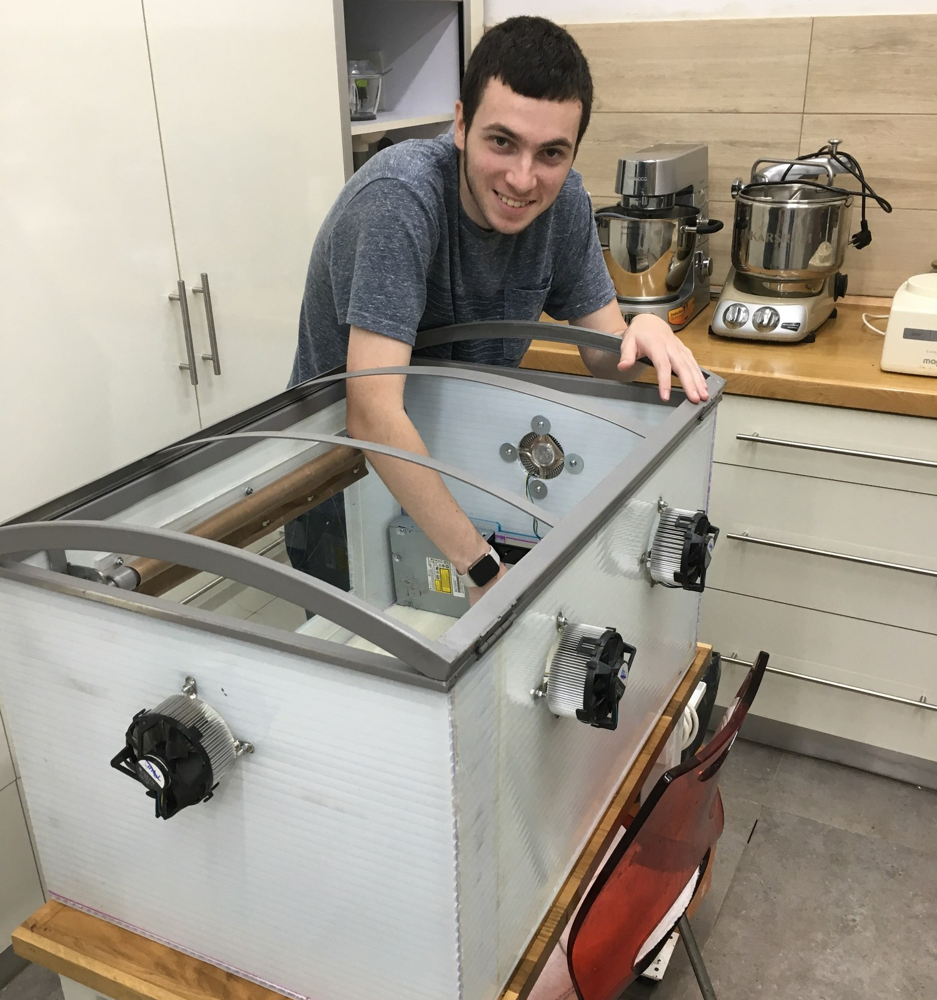
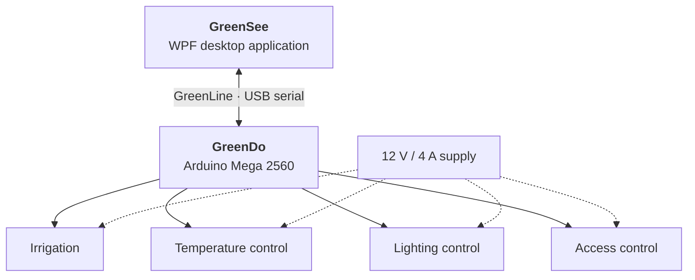
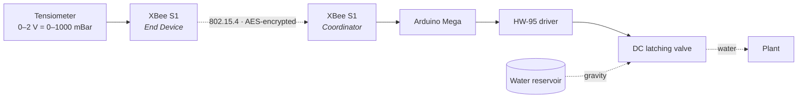

# Smart Greenhouse

**Final project — Practical Engineer diploma in Electronics, ORT Rehovot (2019)**

An autonomous greenhouse controller. It irrigates from wireless soil-tension measurements,
regulates temperature in closed loop, runs a scheduled day/night lighting cycle with a
motorised blind, and gates physical entry behind a keypad — all supervised from a Windows
desktop application over a serial protocol we designed ourselves.

<!-- Replace with a photo of the finished model -->
<p align="center">
  
</p>


---

## Contents

- [Overview](#overview)
- [System architecture](#system-architecture)
- [Subsystems](#subsystems)
- [Hardware](#hardware)
- [Pin map](#pin-map)
- [The GreenLine protocol](#the-greenline-protocol)
- [Firmware design](#firmware-design)
- [Measurements and results](#measurements-and-results)
- [Engineering log: the bugs worth reading about](#engineering-log-the-bugs-worth-reading-about)
- [What I would do differently today](#what-i-would-do-differently-today)
- [Repository layout](#repository-layout)
- [Building and running](#building-and-running)
- [Authors and credits](#authors-and-credits)

---

## Overview

Commercial greenhouses of the time still expected a human in the loop for watering,
ventilation and light scheduling. The goal here was to push user intervention as close to
zero as we could, while keeping every decision observable and reconfigurable from a PC.

The system is built from three named pieces:

| Name | What it is | Where it runs |
| --- | --- | --- |
| **GreenDo** | The side that *does*. Control firmware. | Arduino Mega 2560 |
| **GreenSee** | The side that *sees*. Configuration and telemetry UI. | Windows desktop, C# / WPF |
| **GreenLine** | The link between them. Custom ASCII serial protocol. | USB serial, 9600 8N1 |

The soil sensor sits with the plant, physically away from the controller, and reaches it
over an encrypted 2.4 GHz radio link rather than a cable.

### My role

A two-person project. My own contribution was the firmware architecture and
implementation, both ends of the GreenLine protocol, XBee integration and register
configuration, the desktop application, and system integration and fault-finding.

## System architecture



The four subsystems are mutually independent — none of them depends on another's state.
Everything drawing real power (motors, lighting, solenoid valve) runs off an external
12 V rail; the Arduino only ever switches it through relays and H-bridge drivers.

## Subsystems

### Irrigation — the wireless half



A tensiometer measures how hard roots must work to draw water, which is a far better
irrigation signal than raw moisture. The remote node samples it and transmits every
5 seconds; the controller waters only when the scheduled slot arrives **and** the soil is
genuinely dry, so a rainy week costs no water.

Two details worth calling out:

- **Power budget.** The remote node runs on a 9 V battery with no mains nearby, so the
  radio is duty-cycled: sample every 500 ms, then sleep 4 seconds out of every 5. That is
  an 80 % sleep ratio, works out to roughly 1 mA average, and gives about 600 hours —
  a month — from a 600 mAh cell. The battery voltage is itself telemetered through a
  divider so the UI can warn before it dies.
- **Valve choice.** A DC latching solenoid, driven by a pulse of ~100 ms in one polarity to
  open and the reverse polarity to close. It draws no current while held open, which
  matters when an irrigation cycle runs for minutes.

### Temperature control

Two TMP36 sensors are sampled once per second and averaged, then passed through a
10-sample running mean with outlier rejection. Above the configured ceiling four fans
switch on through a relay board; below the floor they switch off. The hysteresis band
between the two thresholds is what stops the fans chattering.

### Lighting control

A weekly schedule defines when the plant should have light and when it must have darkness.
During a light window the controller measures ambient level with an LDR; if it is too dim
it raises the blind, waits for the reading to settle, and only turns on the LED strip if
daylight still is not enough. During a dark window it kills the strip and lowers the blind.
The blind motor runs through an H-bridge with PWM on the enable pin to slow it down.

### Access control

Entry requires a 4-digit code on a matrix keypad. The door itself is the tray mechanism
salvaged from a computer CD drive, driven by an H-bridge. Correct code opens the door and
auto-closes it after 10 seconds; `*` closes it immediately. Three wrong codes lock the
keypad for 30 seconds. A button inside the greenhouse opens the door unconditionally, so
nobody gets shut in.

## Hardware

| Category | Parts |
| --- | --- |
| Control | Arduino Mega 2560, 12 V / 4 A supply |
| Radio | 2 × XBee S1 802.15.4, XBee Arduino shield, Pololu S7V8F3 regulator |
| Sensing | 2 × TMP36, LDR + 10 kΩ divider, analog tensiometer |
| Actuation | 4-channel relay board, single relay, 3 × HW-95 (L298N) drivers |
| Loads | 4 × 12 V fans, LED strip, DC latching valve, blind motor, CD-drive door |
| Interface | 4 × 4 matrix keypad, internal push button |
| Interconnect | DB25 between the external control board and the greenhouse interior |

The DB25 is there so the control electronics and the greenhouse model can be transported
and serviced separately — a decision that later caused one of the more interesting faults
(see the engineering log).

## Pin map

| Pin | Direction | Function |
| --- | --- | --- |
| 2 | PWM out | Door driver `ENA` |
| 3 | PWM out | Water valve driver `ENB` |
| 4 | PWM out | Blind driver `ENA` |
| 18 / 19 | UART1 | `TX` / `RX` to the XBee shield |
| 22–25 | Digital in | Keypad `COL0`–`COL3` |
| 29 | Digital in, pull-up | Interior door button |
| 30 / 31 | Digital out | Door driver `IN1` / `IN2` |
| 32–35 | Digital out | Fan relay `IN1`–`IN4` |
| 36 / 37 | Digital out | Valve driver `IN3` / `IN4` |
| 38 / 39 | Digital out | Blind driver `IN1` / `IN2` |
| 40 | Digital out | LED strip relay `IN` |
| 41–44 | Digital in | Keypad `ROW0`–`ROW3` |
| A0 / A1 | Analog in | Temperature sensors 1 and 2 |
| A2 | Analog in | LDR divider |

## The GreenLine protocol

A deliberately simple line protocol, chosen because it stays readable in a terminal and
needs no framing logic beyond a start character. Both ends implement the same receive
state machine.

```
~ <type> = <comma-separated values> <LF>
```

**Controller to UI**

| Type | Payload | Example |
| --- | --- | --- |
| `D` | Debug string | `~D=Open Water Valve` |
| `C` | Filtered temperature, °C | `~C=26` |
| `T` | Controller clock | `~T=20:25` |
| `B` | Remote battery voltage | `~B=8.3` |
| `M` | Tensiometer voltage | `~M=0.71` |
| `L` | Filtered light level, LUX | `~L=638` |
| `R` | Link RSSI | `~R=43` |

**UI to controller**

| Type | Payload |
| --- | --- |
| `I` | Full day schedule: day, enable, irrigation time, duration, light window |
| `L` / `H` | Low / high temperature thresholds |
| `U` | Soil dryness threshold, volts |
| `V` | Low-light threshold, LUX |
| `Y` / `Z` | Blind travel time up / down, seconds |
| `T` | Set clock: day, hour, minute, second |
| `X` | Manual actuator test, 1–8 |

## Firmware design

GreenDo targets the Mega and pulls in no third-party libraries other than the keypad
driver. The Arduino toolchain compiles everything as C++, but the firmware is deliberately
written in a C style: plain structs, static arrays, function pointers and a raw timer
interrupt, with no dynamic allocation, exceptions or runtime type information — none of
which belong on a part with 8 KB of RAM. It has three parts:

1. **`setup()`** — initialises hardware, drives every actuator to a known state, and
   configures the XBee registers by sending AT command frames over UART1.
2. **`loop()`** — polls the keypad and the serial receive path. Event-driven, no blocking.
3. **A 1 Hz hardware timer interrupt** — the heartbeat. Advances the clock, evaluates the
   irrigation schedule, samples and filters both sensor chains, and services the software
   timers.

The software timers are the part I am most pleased with. They are one-shot, each holding a
countdown and a function pointer, and they exist because `delay()` cannot be used inside an
interrupt. Anything that needs "do this, then do that in N seconds" — pulse the valve
driver, auto-close the door, release the keypad lockout, re-check the light level after the
blind has finished travelling — arms a timer with a callback instead of blocking.

Both XBee framing and the GreenLine protocol are parsed with explicit state machines
rather than blocking reads, so a truncated or corrupted message can never wedge the
controller.

## Measurements and results

**Tensiometer, drying from watered soil**

| Date | Voltage |
| --- | --- |
| 1 Feb | 0.226 V |
| 3 Feb | 0.135 V |
| 5 Feb | 0.340 V |
| 6 Feb | 0.615 V |
| 7 Feb | 0.814 V |

Immediately after watering the reading dropped back to 0.12 V. From this the dryness
threshold was set at 0.7 V.

**Other figures**

- Temperature chain validated against a laboratory thermometer: 22.2 °C reference against
  21–22 °C measured.
- Radio link lost at roughly 40 m through partial obstruction, last RSSI −85 dBm.
- Worst-case current with every subsystem energised at once: 4.17 A against a 4 A supply.
  Accepted deliberately — the blind, valve and door only run for seconds at a time, so the
  overlap is not physically reachable.

## Engineering log: the bugs worth reading about

Most of the real learning is in here rather than in the parts that worked first time.

**The timer that fired exactly once.** The overflow interrupt triggered and never came
back. The counter register has to be reloaded with the preload value inside the handler —
otherwise it starts counting from zero and the period is wrong forever after.

**The freeze after sixty seconds.** Everything called from `loop()` stopped, while
everything called from the interrupt kept running. The cause was one byte:

```c
char TimeString[5];                        // "HH:MM" is 5 characters...
sprintf(TimeString, "%02d:%02d", Hour, Minute);   // ...plus a NUL terminator
```

`sprintf` wrote its terminator past the end of a stack-allocated array and, we believe,
over the function's return address. `loop()` returned into nowhere. The interrupt survived
because its vector lives at a fixed address. A single missing byte, an hour of searching,
and a lesson about stack layout that stuck.

**`delay()` silently does nothing inside an interrupt.** It depends on a timer interrupt
that cannot fire while another handler is executing. The latching valve needs a pulse of at
least 100 ms; with `delay()` neutered, the enable line was raised and dropped in the same
instant and the valve never moved. This is what the software timer system was built for.

**Endianness.** The XBee transmits 16-bit fields most-significant byte first; the AVR is
little-endian. ADC values came back as nonsense until we compared them against what the
vendor's configuration tool was showing and wrote a byte-swap.

**The DB25 that ate 20 degrees.** After integration the temperature read about 20 °C low.
Probing found roughly 0.1 V lost between the sensor pin and the Arduino pin. Wired
directly with jumpers, the readings were correct. We never fully root-caused it — most
likely the solder joints at the connector — but it is a good reminder that an analog signal
routed through a connector is not the same signal.

**Temperature spikes to 65 °C.** Fixed in three layers: a 0.1 µF decoupling capacitor at
each sensor as the datasheet recommends, a 10-sample running average, and rejection of any
sample too far from the current mean.

**Timer 3 broke the door.** The door driver's enable line was on pin 2 with PWM to soften
the motion, and after integration the door stopped moving entirely. Each AVR timer owns a
set of PWM pins, and by taking over Timer 3 for the 1 Hz heartbeat we had disabled PWM on
pin 2. Moving the heartbeat to Timer 4 fixed it. We had worked around it with plain
digital writes for weeks before finding the actual cause.

## What I would do differently today

Written now, as a third-year Electrical and Electronics Engineering student specialising in
embedded computer systems.

- **The interrupt does far too much.** Three analog reads, two filter chains, serial
  printing and radio handling all execute in interrupt context at 1 Hz. It should set a
  flag and return in microseconds, with `loop()` doing the work. That single change would
  have prevented the `delay()` problem instead of requiring a timer framework to work
  around it.
- **No dynamic allocation on an AVR.** The firmware is otherwise free of heap use, but the
  GreenLine parser reaches for the Arduino `String` class — a C++ container that
  reallocates on every append. That single dependency is the only thing that can fragment
  an 8 KB heap over a long run. A fixed-buffer tokeniser costs a few more lines and cannot
  fail this way.
- **Framing needs a checksum.** GreenLine trusts a start character and a line feed. The
  XBee link already carries a checksum; the USB link should too.
- **Add a watchdog.** With no watchdog, the sixty-second freeze meant a dead greenhouse
  until someone noticed. On an unattended controller that is the difference between a
  glitch and dead plants.
- **The clock should be hardware.** A software day-clock derived from a crystal drifts, and
  loses everything on power failure. A dedicated real-time clock module with a backup cell
  is the right answer for schedule-driven equipment.
- **The AES key is a literal in the source.** Fine for a school project, wrong as a habit.
  Keys belong in provisioned storage, not in a file that ends up on GitHub.
- **Nothing is testable in isolation.** The protocol parsers are pure functions over byte
  streams and could have been unit tested on a PC, entirely separately from the hardware.

## Repository layout

```
.
├── firmware/             Arduino Mega control firmware
├── desktop/              Windows configuration and telemetry UI (C# / WPF)
├── docs/                 Project book, schematics, block diagrams
└── media/                Photographs of the build
```

## Building and running

**Firmware.** Open `firmware/GreenDo/GreenDo.ino` in the Arduino IDE, install the `Keypad`
library, select *Arduino Mega 2560*, and upload. The XBee registers are configured by the
firmware itself at startup, so a fresh coordinator module needs no manual setup. The remote
node's registers were set once with the vendor's configuration tool and are held in its
non-volatile memory.

**Desktop application.** Open `desktop/GreenSee.sln` in Visual Studio. It targets .NET
Framework 4.6.1 and WPF, so it needs Windows and the matching targeting pack. The serial
port name is hard-coded in the `MainWindow` constructor and must be changed to match the
port the Arduino enumerates as.

## Authors and credits

Submitted by **Eilon Yanko** and **Roi Melman**. My own share of the work is described
under [My role](#my-role).

Supervised by Moshe Guetta, B.Sc. With thanks to Eyal Kodler, head of the electronics
department; to Tzachi Koval, agronomist, for guidance on irrigation, tensiometers and plant
light cycles; and to Yehezkel, metalworker, for the greenhouse roof and blind frame.

Published as a portfolio piece. No licence is granted — all rights reserved.
